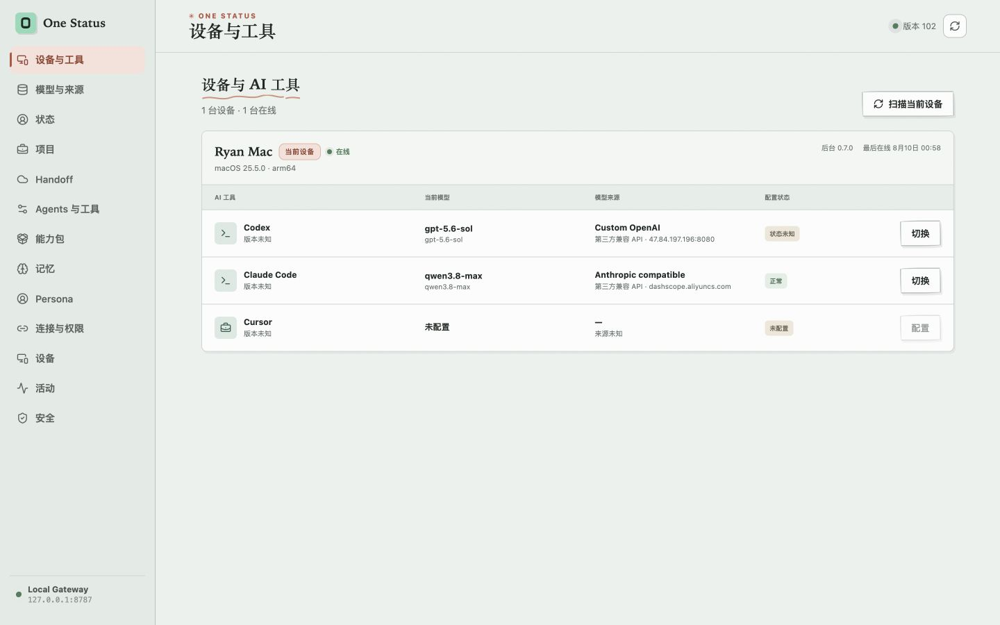
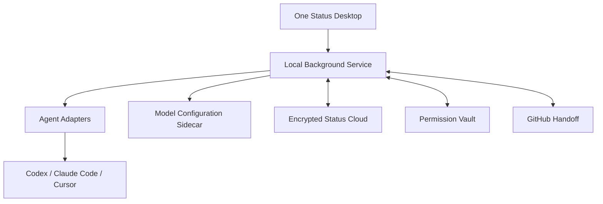

# One Status

**一处管理所有设备上的 AI 工具、模型和个人偏好。**

One Status 是跨设备的个人 AI 工具控制中心。它显示每台设备安装的 AI 工具，统一管理模型与来源，并通过 Persona Skill 持续积累用户记忆。

```text
设备 → AI 工具 → 模型来源 → 模型 → 配置关系
```

[官网](https://niyuxuan782.github.io/one-status/) · [最新 Release](https://github.com/niyuxuan782/one-status/releases/latest) · [v0.7 产品边界](docs/v0.7-product.md) · [安装文档](docs/installation.md)

> 当前版本为 `v0.7.0`。设备与 AI 工具矩阵、模型来源、确认式模型配置、离线配置意图、原子恢复、Persona Skill、Capability Packs、受控 Tool Gateway 和 Git Handoff 已可运行。

## 真实操作视频

v0.7 已完成本机 GUI、双 Agent MCP 和双设备加密 Demo 验收。完整的双物理设备操作视频会连续展示：

1. 读取两台设备的 Codex、Claude Code 与 Cursor 清单。
2. 选择模型来源并预览目标配置变更。
3. 在线设备立即应用，离线设备上线后处理待执行意图。
4. 对话触发 `persona.record`，另一台设备读取同一条加密 Persona 记录。
5. 从 Claude Code 发布 Handoff，再由 Codex 继续项目。

[查看视频录制与验收清单](docs/v0.7-product.md#文档与媒体)

现在可以运行仓库内的双设备、双 MCP 可复现 Demo：

```bash
pnpm install
pnpm demo
```

Demo 使用两个独立 MCP 进程，在临时目录内完成注册、加密同步、Agent 交接与敏感值落盘检查。

## 一键安装

### Desktop App

macOS、Linux：

```bash
curl -fsSL https://niyuxuan782.github.io/one-status/install.sh | bash
```

Windows PowerShell：

```powershell
irm https://niyuxuan782.github.io/one-status/install.ps1 | iex
```

安装器从 GitHub Releases 下载对应平台附件，并使用同一 Release 的 `SHA256SUMS.txt` 校验。当前桌面版属于未签名 Preview，操作系统会执行正常的安全检查。

### Homebrew

桌面 App：

```bash
brew tap niyuxuan782/tap
brew install --cask niyuxuan782/tap/one-status
```

CLI、MCP 与本机后台服务：

```bash
brew tap niyuxuan782/tap
brew trust --formula niyuxuan782/tap/one-status 2>/dev/null || true
brew install --formula niyuxuan782/tap/one-status
brew link --overwrite --force niyuxuan782/tap/one-status
brew services start niyuxuan782/tap/one-status
```

`brew link` 可以重复执行，并确保已经安装同名 Cask 时，`one-status` CLI 仍会进入 Homebrew 的全局命令目录。

### CLI

```bash
curl -fsSL https://niyuxuan782.github.io/one-status/install.sh | bash -s -- --cli
one-status app
```

v0.7 CLI 安装器会同时安装经过 SHA-256 校验的本机 Device Sidecar。CLI、MCP 与后台服务可以直接调用本机模型扫描、配置预览、原子应用和回滚能力。

其他安装方式、原生产物和发布流程见 [安装与发布](docs/installation.md)。

## 设备与模型



上图来自 `v0.7.0` 本机工作台。首页聚焦设备、AI 工具、当前模型、来源与配置健康状态：

```text
Ryan's MacBook Pro                         在线
├── Codex          GPT-5.4       OpenAI          [切换]
├── Claude Code    Claude Opus   Anthropic       [切换]
└── Cursor         未配置                         [配置]

Office Mac mini                            离线
├── Codex          GPT-5.4       第三方兼容 API   [待应用]
└── Claude Code    Claude Sonnet Anthropic       [切换]
```

模型来源统一归为：

- 官方账号
- 官方 API
- 第三方兼容 API
- 本地模型服务
- 自定义 Endpoint

配置流程会先生成预览，再由用户确认。在线设备的本机后台执行原子写入，离线设备保存加密配置意图；失败时恢复原文件。API Key 只进入 Permission Vault，不进入 Agent 上下文、Activity 日志或普通 Status 字段。

| 能力 | v0.7.0 状态 |
| --- | --- |
| 设备 heartbeat、在线状态、后台版本 | 已交付 |
| Codex、Claude Code 当前模型与来源识别 | 已交付 |
| 多设备配置意图 | 已交付：`pending → applying → applied / failed / rollback` |
| 模型切换 | 已交付：文件级预览、确认、原子写入与恢复 |
| Cursor 配置 | 已纳入工具矩阵；模型写入等待 One Status Cursor Extension |

## Persona 记忆

v0.7 提供统一 `persona` Skill。Agent 识别到用户明确要求记住的信息、语言风格、项目习惯、技术偏好或长期规划后，调用 `persona.record`：

```yaml
id: persona-event-id
category: language_style
content: 偏好简洁、直接的中文技术回答
observedAt: 2026-08-09T22:30:00+08:00
sourceAgent: codex
sourceProject: one-status
confidence: explicit
```

- **Persona Events** 保留每次有效观察的时间、来源 Agent 和项目。
- **Persona Profile** 合并重复观察，维护 `lastObservedAt` 与出现次数。
- 用户可以查看来源、编辑、删除，并禁止某一类别继续记录。
- 完整原始会话默认留在本机，跨设备同步结构化记录的 E2EE 密文。

Codex 与 Claude Code 已安装同一份 Persona Skill。跨 Agent 写入与读取、重复观察合并、来源时间、编辑、删除和类别策略均已通过验收。

## Handoff

当前版本已经支持 Claude Code 与 Codex 的 Git Handoff：

```text
设备 A 采集 branch / commit / dirty state
→ 生成 HANDOFF.md 与 .one-status/handoff.json
→ Secret 扫描和用户确认
→ 推送 GitHub 并同步加密引用
→ 设备 B 校验精确 commit 与文件摘要
→ Continue with Codex / Claude Code
```

程序采集 Git 与文件事实，Agent 只负责目标、决策、完成项和下一步等语义内容。本机绝对路径按设备独立保存，项目代码与大文件继续由 GitHub 承载。

命令行可以调用同一条工作流：

```bash
one-status handoff --project one-status --agent claude-code
one-status handoff --project one-status --agent claude-code --publish
```

第一条命令执行预检。`--publish` 会进入显式确认后的文件写入、commit 与 push 流程。

## 隐私边界

- Status Key 在首台设备本地生成，不上传服务端。
- Memory、Persona、Preferences、Task State 与配置意图在设备端使用 AES-256-GCM 加密。
- 云端保存账号和设备元数据、密文 envelope 与同步版本。
- macOS 的设备 Token 与 Status Key 默认存入系统 Keychain。
- Provider Token 与 API Key 留在本机 Permission Vault；跨设备 Vault bundle 会在同步前二次加密。
- Agent 通过 One Status Gateway 获得按 action 控制的调用能力，不接触第三方 Refresh Token。
- 模型配置文件和本机绝对路径由每台设备的后台服务维护。
- 写操作和外部副作用要求精确参数审批，Activity 只保存脱敏审计信息。
- 原始 Agent 会话默认留在本机。

安全假设与剩余风险见 [Threat Model](docs/threat-model.md)。

## 开发与贡献

环境要求：Node.js 22+、pnpm 10+。

```bash
git clone https://github.com/niyuxuan782/one-status.git
cd one-status
pnpm install
pnpm --filter @one-status/desktop dev
```

提交前运行：

```bash
pnpm typecheck
pnpm test
pnpm build
pnpm check
pnpm demo
```

适合继续贡献的方向：

- 更多 Codex、Claude Code、Cursor 模型来源 fixtures
- Windows 与 Linux 原生包的真实设备覆盖
- Persona 分类与 Profile 合并策略
- macOS、Windows、Linux 的 Credential Store 适配
- 两台物理设备的离线配置意图验收视频
- 无剪辑的真实操作视频与复现脚本

仓库主体使用 Apache-2.0。v0.7 Device Sidecar 的开发实现参照并改写 [CC Switch](https://github.com/farion1231/cc-switch) `3.19.2` 的 MIT 代码，固定上游 commit 为 [`413c09e0790c304506888ae24b9be72820aca126`](https://github.com/farion1231/cc-switch/commit/413c09e0790c304506888ae24b9be72820aca126)。逐文件来源记录在 [`apps/device-sidecar/SOURCES.md`](apps/device-sidecar/SOURCES.md)，完整 notice 位于 [`apps/device-sidecar/THIRD_PARTY_NOTICES.md`](apps/device-sidecar/THIRD_PARTY_NOTICES.md)，MIT 原文副本位于 [`apps/device-sidecar/third_party/cc-switch/LICENSE`](apps/device-sidecar/third_party/cc-switch/LICENSE)。Sidecar 已进入 v0.7 Desktop 与独立 CLI 原生附件。

## 当前系统组成



当前仓库还包括：

- Identity、Preferences、Memory、Projects、Workspace、Permissions、Tools 与 Tasks Status Schema
- AES-256-GCM 客户端加密、带版本条件写入、幂等 mutation 与冲突重试
- Codex Plugin、Claude Skill、Cursor Rules、Markdown 与 Local MCP Adapter Engine
- 15 个 Capability Packs、14 个 Provider、69 个固定 Gateway actions 和 7 个 Persona MCP tools
- stdio MCP 与带 bearer 认证的 Streamable HTTP MCP
- 图形化账号、设备、项目、Memory、Connections、权限、Handoff、Activity 与 Security 页面
- 腾讯云上的密文 Sync API：<https://os.furesta.top>

## Agent 接入

Codex：

```bash
codex mcp add one-status \
  -- one-status mcp --transport stdio --agent codex
```

Claude Code：

```bash
claude mcp add --scope user one-status \
  -- one-status mcp --transport stdio --agent claude-code
```

连接成功后，Agent 会先通过 `tools_list` 查看用户允许的第三方 action，再用 `tools_execute` 调用 One Status Gateway。模型供应商和 API Key 类型不会改变 Gateway 的权限边界。

## 文档

- [v0.7 产品边界](docs/v0.7-product.md)
- [产品架构](docs/product-architecture.md)
- [安装与发布](docs/installation.md)
- [Provider 集成](docs/provider-integrations.md)
- [Open Core](docs/open-core.md)
- [云端部署](docs/deployment.md)
- [Threat Model](docs/threat-model.md)
- [技术路线](docs/technical-roadmap.md)
