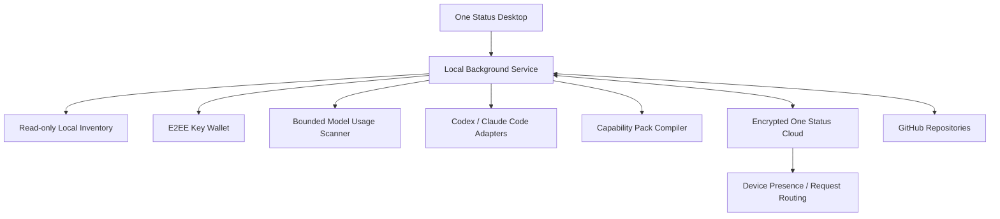

# One Status 产品架构 v0.8

## 产品定义

> One Status 是跨设备的个人 AI 控制中心。它统一管理设备上的 AI 工具、加密密钥、模型、记忆、连接、项目与工作状态。

第一阶段体验目标：

> 一处管理所有设备上的 AI 工具、密钥、模型和记忆。

## 运行拓扑



桌面应用负责确认和操作，本机后台服务负责扫描、同步、Adapter 与 Handoff。云端保存加密状态和最少量路由元数据。GitHub保存代码、项目文档和用户确认发布的 Handoff 文件。

## 密钥钱包

每台设备后台只读扫描 Codex 的全部 `model_providers`、Claude Code 活动设置、环境变量引用，以及 CC Switch 数据库中保存的 Codex / Claude Profile。API Key 在本机短时敏感通道中完成指纹计算和 Vault 写入；公开 Inventory、日志与 Agent 上下文只接收脱敏元数据。

```text
Local config / CC Switch profile
  -> local credential discovery
  -> domain-separated SHA-256 fingerprint
  -> encrypted Permission Vault entry
  -> E2EE Vault bundle sync
  -> source ID + model metadata in encrypted Status
```

查看或复制密钥需要钱包密码。初始密码为 `123456`，用户可以在安全页修改。钱包只同步随机 salt 和 scrypt verifier，不保存密码明文。模型切换传递 source ID，由目标设备本地解密密钥并原子写入 Agent 配置。

模型用量由 Device Sidecar 有界读取 Codex `token_count` 与 Claude assistant `message.usage`，按消息或事件去重后聚合到模型。设备报告每 5 分钟最多同步一次脱敏汇总，原始会话和文件路径继续留在本机。

## Capability Pack

Capability Pack 是 One Status 的统一能力单位。一份严格 YAML 或 JSON manifest 描述 Tools、Skills、Instructions、Memory scopes、Authorization、Dependencies、UI、Events、Hooks 和目标 Adapters。Manifest 经过规范化后生成稳定 `sha256:` 摘要，写操作必须声明确认要求，文件路径禁止绝对路径、目录穿越和符号链接替换。

```text
Capability Pack manifest
  -> schema and semantic validation
  -> deterministic Adapter compilation
  -> dry-run install preview
  -> explicit approval
  -> atomic local write and platform registration
  -> encrypted installation intent sync
```

当前 Adapter Engine 支持 Codex Plugin + Skill + MCP + `AGENTS.md`、Claude Skill + MCP + `CLAUDE.md`、Cursor Rules + MCP、Markdown Context 和 Local MCP。编译产物带稳定 `planId`、逐文件 SHA-256、旧摘要前置条件和审计元数据，Provider Token 不进入 manifest 或输出文件。

Status schema v3 同步包 ID、版本、manifest digest、目标平台、启用状态和时间戳。绝对路径、临时文件和平台缓存由各设备自行管理。

## Universal Tool Gateway

Codex、Claude Code 及使用第三方模型 API 的 Agent 只需要连接 One Status MCP。Agent 可以通过 `capabilities_get` 读取能力目录和安装状态；遇到邮件、日历、文件、协作、项目管理或设计任务时，MCP instructions 要求 Agent 先读取 `tools_list`，再通过 `tools_execute` 调用获准 action。One Status 在本机完成 Token 使用、刷新、scope 校验和审计，模型上下文只接收规范化后的业务结果。

```text
Agent request
  -> tools_list(agentId)
  -> connection + action + risk metadata
  -> tools_execute(connectionId, action, arguments)
  -> connection grant + action grant + scope check
  -> optional user confirmation
  -> provider API
  -> normalized result + audit event
```

固定 action registry 禁止 Agent 自定义 URL、HTTP method 或 Authorization header。写操作带 `requiresConfirmation`，读取 action 带 `readOnly`，这些元数据同时进入 MCP 返回和 Dashboard 权限界面。

## 数据边界

| 数据 | 位置 | 云端可读 |
| --- | --- | --- |
| Memory、Preferences、项目摘要、Task State | One Status E2EE | 否 |
| Status ciphertext、revision、mutation receipt | One Status Cloud | 仅密文与同步元数据 |
| 设备在线时间 | One Status Cloud | 是 |
| Capability Pack manifest、版本、摘要和安装意图 | One Status E2EE；实际输出留在设备 | 否 |
| Skills、Rules、MCP Manifest | 本机；确认后由 Adapter 生成 | 默认否 |
| OAuth Token、模型 API Key、钱包 verifier | 本机 Permission Vault；二次加密 bundle 随 Status 同步 | 否 |
| 模型 Token 汇总、请求数、数据来源和统计时间 | Device Sidecar 聚合；随加密设备报告同步 | 否 |
| 项目代码、大文件、`HANDOFF.md` | GitHub | 受 GitHub 仓库权限控制 |
| 本机绝对路径 | 每台设备本地映射 | 否 |
| 原始 Agent 会话 | 本机 | 否 |

核心原则：One Status 同步状态和位置，GitHub 同步项目内容。

## 本机 Inventory

首版扫描器只读以下来源：

- Codex、Claude Code 与 Cursor 安装状态
- Codex 全部 Provider、Claude 活动配置与 CC Switch 保存的 Profile
- Codex 和 Claude Code 已登记的项目目录
- 用户通过 `ONE_STATUS_SCAN_ROOTS` 明确指定的项目根目录
- MCP 结构化清单
- Codex、Claude Code Skills 与 Plugins
- `AGENTS.md`、`CLAUDE.md` 等规则文件元数据

扫描限制：

- 不递归遍历整个 Home 目录
- 不跟随 symlink 项目
- 项目、Skills、配置文件均有数量和大小上限
- MCP env 仅保留变量名
- HTTP endpoint 删除 query 和 fragment
- Skill 与 Rule 内容不进入 Inventory response
- 公开清单只进入回环 Dashboard；模型元数据进入加密 Status
- API Key 经本机敏感通道直接进入 Permission Vault，不进入公开清单

默认从结构化配置生成清单。需要调用 Agent CLI 补充运行时清单时，可以临时设置 `ONE_STATUS_INVENTORY_RUN_AGENT_COMMANDS=true`；该选项不会作为后台服务默认值。

## 设备身份与在线状态

每次安装生成稳定 `installationId`。同一安装重新登录会复用设备记录并更新名称，不会持续生成重复设备。

客户端通过 `POST /v1/devices/heartbeat` 更新活动时间。90 秒内有有效认证活动的设备显示在线。该信号只表达 One Status 后台连通性，Agent 运行状态由后续 Adapter heartbeat 单独提供。

## One Status Cloud

生产云仅运行 Sync API：

- 账号、密码 hash、设备 session 与撤销
- 加密 Status envelope
- CAS revision 与 mutation 幂等
- 设备 presence
- 登录与注册限流
- HTTPS、健康检查、持久化与备份

云端不配置 Status Key、本地 profile 或可解密 Permission Vault。云端只看到外层 Status ciphertext；其中的 Permission Vault bundle 还使用 Status Key 派生密钥独立加密。当前 HTTP MCP 适合单用户信任的远程运行时，不进入多人共享云进程。

## GitHub 与 Handoff

第一版 Handoff 合同：

```text
Publish Handoff
  -> collect Git branch / commit / dirty state / tests
  -> run Secret scan
  -> show confirmation
  -> create HANDOFF.md + handoff.json
  -> commit or preserve exact existing commit
  -> push GitHub
  -> sync encrypted Handoff manifest
```

```text
Open and Continue
  -> resolve GitHub repository and exact commit
  -> clone or update local checkout
  -> verify worktree
  -> map local path on this device
  -> open Codex or Claude Code
  -> inject Handoff context
```

Git、测试和 Secret 结果由程序采集。Agent 只负责生成目标、决策、完成项和下一步的候选内容。自动 push 默认关闭。

## 桌面页面

| 页面 | 当前状态 |
| --- | --- |
| 概览 | 设备在线状态、已安装 AI 工具、当前模型、可配模型与跨设备模型用量 |
| 密钥钱包 | 自动发现的 API Key、Endpoint、协议、模型、查看/复制验证与免密码模型切换 |
| 项目 | 便携项目、本机映射、Secret 预览、Publish Handoff 与 Open and Continue |
| 记忆 | Memory、用户细节、观察记录、候选确认、编辑、删除和记录策略 |
| 连接 | 14 个 Provider、固定 actions、OAuth、Agent 权限与对应能力的安装目标 |
| 安全 | 加密状态、钱包密码、Permission Vault、设备和 Agent grants |

## 第一阶段验收

固定场景：

1. Mac A 只读扫描现有开发环境。
2. 用户确认导入已有 Git 项目和 Agent 资产。
3. 用户手动发布 Handoff。
4. 云端同步加密 manifest 与设备状态。
5. Mac B 打开精确 Git commit。
6. 用户选择 Continue with Codex 或 Continue with Claude Code。
7. Agent 获得当前目标、决策、完成项和下一步。

当前已完成云端加密同步、设备 presence、本机 Inventory 与显式项目导入、Status/Task/Memory UI、Codex/Claude MCP、三方真实 OAuth、工具审计，以及手动 Publish Handoff 和 macOS Open and Continue。新发布 Handoff 会记录源 commit 和文件 SHA-256。当前限制包括测试状态仍为 `not_run`、已有 checkout 必须 clean、目标 clone 目录必须尚未存在，以及 Agent 启动依赖 macOS Terminal 与本机 CLI。
