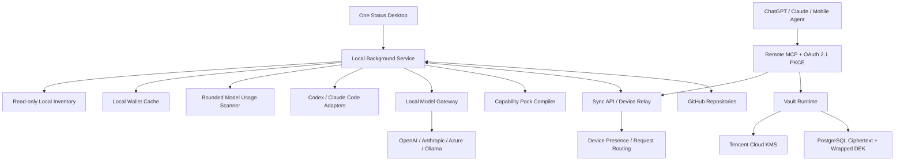

# One Status 产品架构 v0.9

## 产品定义

> One Status 是跨设备的个人 AI 控制中心。它统一管理设备上的 AI 工具、加密密钥、模型、记忆、连接、项目与工作状态。

第一阶段体验目标：

> 一处管理所有设备上的 AI 工具、密钥、模型和记忆。

## 运行拓扑



桌面应用负责确认和本机操作，本机后台服务负责扫描、同步、Adapter、Handoff 与出站 WSS Relay。Remote MCP 服务 ChatGPT、Claude Web/Mobile 和云端 Agent。云端保存加密状态、路由元数据与 KMS Envelope 凭据。GitHub 保存代码、项目文档和用户确认发布的 Handoff 文件。

## 密钥钱包

每台设备后台只读扫描 Codex 的全部 `model_providers`、Claude Code 活动设置、环境变量引用，以及 CC Switch 数据库中保存的 Codex / Claude Profile。API Key 在本机短时敏感通道中完成指纹计算和 Vault 写入；公开 Inventory、日志与 Agent 上下文只接收脱敏元数据。

```text
Local config / CC Switch profile
  -> local credential discovery
  -> domain-separated SHA-256 fingerprint
  -> authenticated Cloud Vault backfill
  -> independent AES-256-GCM DEK per credential
  -> Tencent Cloud KMS wrapped DEK
  -> source ID + model metadata in encrypted Status
```

查看或复制密钥需要钱包密码。初始密码为 `123456`，用户可以在密钥钱包页修改。钱包认证使用 RFC 9807 OPAQUE，密码只在客户端参与计算；服务端保存 registration record。模型切换传递 source ID，目标设备按授权取得密钥并原子写入 Agent 配置。

同一 Permission Vault 也提供通用钥匙串。账号密码、SSH、云控制台、GitHub、数据库、API、OAuth Client、License、卡密、模型、邮箱、VPN、证书、签名、Registry、域名、远程桌面、Webhook 和自定义凭据采用统一结构：

```text
kind + label + purposes + tags
  + searchable fields (host / URL / username / account / region)
  + encrypted secrets (password / token / private key / card key)
  + source Agent / device / project
  + Agent and project access policy
  + created / updated / expiration timestamps
```

Cloud Vault 为每个条目生成独立 256-bit DEK，使用 AES-256-GCM 加密完整 Secret，再由腾讯云 KMS 的 KEK 包装 DEK。PostgreSQL 保存密文、IV、Auth Tag、Wrapped DEK 和经过字段名白名单约束的非敏感索引。列表与搜索只返回遮罩后的 Secret 字段名；用户查看验证钱包密码。Agent 使用最长一小时的短期 Session 和独立 Grant 调用 `credentials_resolve` 与 `credentials_get`，无需钱包密码。Project ID 必须由服务端签发的 Session 绑定。远程登记、更新和删除使用一次性审批 Token，审批绑定 Agent Session、操作和完整请求摘要。每次读取、登记、更新和删除都写入不含 Secret 的云端审计记录，凭据变更与审计在同一 PostgreSQL 事务提交。

首次 Backfill 迁移凭据明文后由 Vault Runtime 立即重新加密。后续重放只允许相同记录或补齐缺失记录；云端条目已经更新或云端存在本机集合之外的条目时返回 `migration_conflict`。钱包 OPAQUE record 通过独立注册流程建立。

模型钱包记录动态映射为稳定 UUID 的 `kind=model` 凭据，沿用原模型表和删除墓碑，不复制第二份 API Key。Agent 可以按 `model.api` 或 `model.configure` 读取；轮换后回写原模型凭据。

## Model Gateway

每个非官方账号来源都记录独立的 API 请求格式。当前支持 OpenAI Responses、OpenAI Chat Completions、Anthropic Messages、Azure OpenAI 和 Ollama。目标工具使用固定、可验证的本机协议：Codex 使用 Responses，Claude Code 使用 Anthropic Messages。本机 Model Gateway 负责请求、流式事件、工具调用、用量和错误结构转换。

```text
Permission Vault source + upstream API format
  -> source-bound local Gateway token
  -> Codex Responses / Claude Code Anthropic endpoint
  -> protocol conversion on 127.0.0.1
  -> provider API
```

上游 API Key 不进入 Agent 配置。Adapter 只写入回环 Gateway 地址和按来源绑定的 Token，并保留 MCP、Rules、Skills 与其他 Provider 配置。官方账号会话继续留在对应原生工具中。Cursor 需要 One Status 扩展后才能接管模型调用，当前 Adapter 会阻止无效写入。

模型用量由 Device Sidecar 有界读取 Codex `token_count` 与 Claude assistant `message.usage`，按消息或事件去重后聚合到模型。设备报告每 5 分钟最多同步一次脱敏汇总，原始会话和文件路径继续留在本机。

## Capability Pack

Capability Pack 是 One Status 的统一能力单位。一份严格 YAML 或 JSON manifest 描述 Tools、Skills、Instructions、Memory scopes、Authorization、Dependencies、UI、Events、Hooks 和目标 Adapters。Manifest 经过规范化后生成稳定 `sha256:` 摘要，写操作必须声明确认要求，文件路径禁止绝对路径、目录穿越和符号链接替换。

```text
Capability Pack manifest
  -> schema and semantic validation
  -> deterministic Adapter compilation
  -> dry-run install preview
  -> explicit approval
  -> atomic local write and platform registration
  -> encrypted installation intent sync
```

当前 Adapter Engine 支持 Codex Plugin + Skill + MCP + `AGENTS.md`、Claude Skill + MCP + `CLAUDE.md`、Cursor Rules + MCP、Markdown Context 和 Local MCP。编译产物带稳定 `planId`、逐文件 SHA-256、旧摘要前置条件和审计元数据，Provider Token 不进入 manifest 或输出文件。

Status schema v3 同步包 ID、版本、manifest digest、目标平台、启用状态和时间戳。绝对路径、临时文件和平台缓存由各设备自行管理。

## Universal Tool Gateway

Codex、Claude Code 及使用第三方模型 API 的 Agent 只需要连接 One Status MCP。本机 Agent 使用 stdio MCP，云端与移动端 Agent 使用 OAuth 2.1 + PKCE 和 Streamable HTTP MCP。Agent 遇到邮件、日历、文件、协作、项目管理或设计任务时先读取 `tools_list`，再通过 `tools_execute` 调用获准 action。设备连接由 WSS 路由到在线 Desktop；Cloud Vault 凭据工具可以在设备离线时按授权运行。

```text
Agent request
  -> tools_list(agentId)
  -> connection + action + risk metadata
  -> tools_execute(connectionId, action, arguments)
  -> connection grant + action grant + scope check
  -> optional user confirmation
  -> provider API
  -> normalized result + audit event
```

固定 action registry 禁止 Agent 自定义 URL、HTTP method 或 Authorization header。写操作带 `requiresConfirmation`，读取 action 带 `readOnly`，这些元数据同时进入 MCP 返回和 Dashboard 权限界面。

通用钥匙串使用独立的 MCP 工具链：

```text
user supplies reusable secret
  -> credentials_register (masked response)

task needs an existing credential
  -> credentials_resolve (metadata only)
  -> credentials_get (plaintext for immediate execution)

user rotates a credential
  -> credentials_resolve
  -> credentials_update (masked response)
```

MCP instructions 要求 Agent 在用户提供可复用 Secret 的同一轮完成登记，识别到更新或轮换时更新原 ID。所有凭据 API 错误在 MCP 客户端统一转换为不含上游内容的固定错误，避免 Secret 经 stderr 或模型错误上下文泄漏。

## 数据边界

| 数据 | 位置 | 云端可读 |
| --- | --- | --- |
| Memory、Preferences、项目摘要、Task State | One Status E2EE | 否 |
| Status ciphertext、revision、mutation receipt | One Status Cloud | 仅密文与同步元数据 |
| 设备在线时间 | One Status Cloud | 是 |
| Capability Pack manifest、版本、摘要和安装意图 | One Status E2EE；实际输出留在设备 | 否 |
| Skills、Rules、MCP Manifest | 本机；确认后由 Adapter 生成 | 默认否 |
| 模型 API Key、账号密码、SSH、云凭据、卡密 | Cloud Vault：每条凭据独立密文 + KMS Wrapped DEK | 授权请求期间可临时解密指定条目 |
| 钱包 OPAQUE registration record | Cloud Vault PostgreSQL | 仅用于 PAKE 验证，不含钱包密码 |
| 第三方 OAuth Token | 当前本机 Permission Vault；在线 Desktop 通过 Relay 执行 | 默认否 |
| 模型 Token 汇总、请求数、数据来源和统计时间 | Device Sidecar 聚合；随加密设备报告同步 | 否 |
| 项目代码、大文件、`HANDOFF.md` | GitHub | 受 GitHub 仓库权限控制 |
| 本机绝对路径 | 每台设备本地映射 | 否 |
| 原始 Agent 会话 | 本机 | 否 |

核心原则：One Status 同步状态和位置，GitHub 同步项目内容。

## 本机 Inventory

首版扫描器只读以下来源：

- Codex、Claude Code 与 Cursor 安装状态
- Codex 全部 Provider、Claude 活动配置与 CC Switch 保存的 Profile
- Codex 和 Claude Code 已登记的项目目录
- 用户通过 `ONE_STATUS_SCAN_ROOTS` 明确指定的项目根目录
- MCP 结构化清单
- Codex、Claude Code Skills 与 Plugins
- `AGENTS.md`、`CLAUDE.md` 等规则文件元数据

扫描限制：

- 不递归遍历整个 Home 目录
- 不跟随 symlink 项目
- 项目、Skills、配置文件均有数量和大小上限
- MCP env 仅保留变量名
- HTTP endpoint 删除 query 和 fragment
- Skill 与 Rule 内容不进入 Inventory response
- 公开清单只进入回环 Dashboard；模型元数据进入加密 Status
- API Key 经本机敏感通道直接进入 Permission Vault，不进入公开清单

默认从结构化配置生成清单。需要调用 Agent CLI 补充运行时清单时，可以临时设置 `ONE_STATUS_INVENTORY_RUN_AGENT_COMMANDS=true`；该选项不会作为后台服务默认值。

## 设备身份与在线状态

每次安装生成稳定 `installationId`。同一安装重新登录会复用设备记录并更新名称，不会持续生成重复设备。

客户端通过 `POST /v1/devices/heartbeat` 更新活动时间。90 秒内有有效认证活动的设备显示在线。该信号只表达 One Status 后台连通性，Agent 运行状态由后续 Adapter heartbeat 单独提供。

## One Status Cloud

生产云运行相互隔离的服务模块：

- 账号、OPAQUE registration record、设备 session 与撤销
- 加密 Status envelope
- CAS revision 与 mutation 幂等
- 设备 presence
- 登录与注册限流
- OAuth Authorization Server 与 Streamable HTTP Remote MCP
- 出站 WSS Device Relay、多设备能力路由和明确离线状态
- Vault Runtime、PostgreSQL 与腾讯云 KMS Envelope Encryption
- 短期 Agent Session、Credential Grant 和脱敏审计
- HTTPS、健康检查、持久化与备份

云端不配置 Status Key 或本地 profile。Status、Memory 与 Persona 继续保持 E2EE。在线 Desktop 只向 Relay 返回 Profile、Context 或 Memory 的最小投影视图。Vault Runtime 独占 KMS 权限，在 OAuth scope、Agent Grant、凭据策略、用途、项目、过期时间和撤销校验通过后临时解密指定凭据；明文和 DEK 不写日志、不进入缓存和持久层。

## GitHub 与 Handoff

第一版 Handoff 合同：

```text
Publish Handoff
  -> collect Git branch / commit / dirty state / tests
  -> run Secret scan
  -> show confirmation
  -> create HANDOFF.md + handoff.json
  -> commit or preserve exact existing commit
  -> push GitHub
  -> sync encrypted Handoff manifest
```

```text
Open and Continue
  -> resolve GitHub repository and exact commit
  -> clone or update local checkout
  -> verify worktree
  -> map local path on this device
  -> open Codex or Claude Code
  -> inject Handoff context
```

Git、测试和 Secret 结果由程序采集。Agent 只负责生成目标、决策、完成项和下一步的候选内容。自动 push 默认关闭。

## 桌面页面

| 页面 | 当前状态 |
| --- | --- |
| 概览 | 设备在线状态、已安装 AI 工具、当前模型、可配模型与跨设备模型用量 |
| 密钥钱包 | 自动发现的模型 API Key、通用账号与凭据、卡密、查看/复制验证、Agent 按需读取与免密码模型切换 |
| 项目 | 便携项目、本机映射、Secret 预览、Publish Handoff 与 Open and Continue |
| 记忆 | Memory、用户细节、观察记录、候选确认、编辑、删除和记录策略 |
| 连接 | 14 个 Provider、固定 actions、OAuth、Agent 权限与对应能力的安装目标 |
| 安全 | 加密状态、钱包密码、Permission Vault、设备和 Agent grants |

## 第一阶段验收

固定场景：

1. Mac A 只读扫描现有开发环境。
2. 用户确认导入已有 Git 项目和 Agent 资产。
3. 用户手动发布 Handoff。
4. 云端同步加密 manifest 与设备状态。
5. Mac B 打开精确 Git commit。
6. 用户选择 Continue with Codex 或 Continue with Claude Code。
7. Agent 获得当前目标、决策、完成项和下一步。

当前已完成云端加密同步、设备 presence、本机 Inventory 与显式项目导入、Status/Task/Memory UI、Codex/Claude MCP、三方真实 OAuth、工具审计，以及手动 Publish Handoff 和 macOS Open and Continue。新发布 Handoff 会记录源 commit 和文件 SHA-256。当前限制包括测试状态仍为 `not_run`、已有 checkout 必须 clean、目标 clone 目录必须尚未存在，以及 Agent 启动依赖 macOS Terminal 与本机 CLI。
