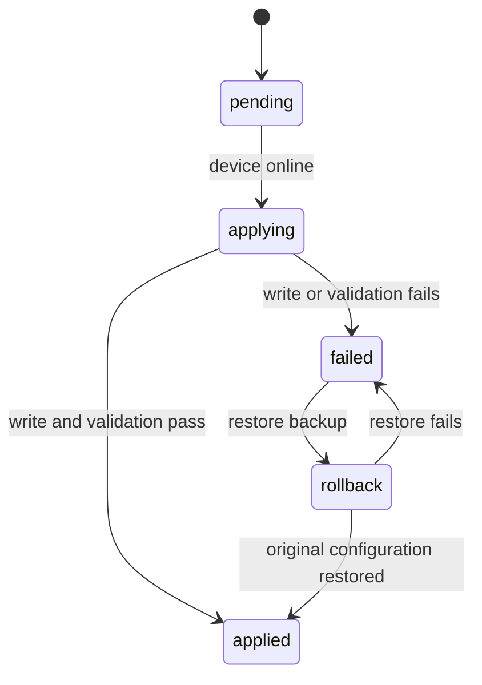

# One Status v0.7 产品边界

## 定义与版本状态

One Status v0.7 的产品定义：

> One Status 是跨设备的个人 AI 工具控制中心。它显示每台设备安装了哪些 AI 工具，统一管理模型与来源，并通过 Persona Skill 持续积累用户记忆。

核心关系：

```text
设备 → AI 工具 → 模型来源 → 模型 → 配置关系
```

当前 Release 为 `v0.7.0`。本文件记录 v0.7 的产品契约、交付边界和验收方法。README、官网与 Release Notes 只标记已经通过代码、测试和运行时验证的能力。

## 第一阶段范围

v0.7 第一阶段包含：

- 首页设备与 AI 工具总览
- 模型来源与模型目录
- Codex、Claude Code 当前模型和来源读取
- 指定设备、指定工具的模型配置预览与执行
- 离线配置意图与设备上线执行
- 原子配置写入、备份、恢复和结果报告
- Persona Skill、Persona Events 与 Persona Profile
- Persona 记录的 E2EE 同步、编辑、删除和类别禁用
- GitHub README、官网与真实操作视频

v0.7 第一阶段排除：

- Agent Network
- Agent Marketplace、Agent Reputation 与 Agent Economy
- 本地协议转换代理
- Provider 自动故障转移
- Token 用量、计费和中转站商城
- Provider 广告或推荐
- Codex OAuth 反向代理

## 首页信息架构

首页删除概览统计、当前上下文、活动项目和通用状态摘要。Projects、Handoff 和 MCP 继续保留对应数据。

首页只呈现以下信息：

- 设备名称、操作系统、在线状态、最后在线时间和后台版本
- 已安装的 AI 工具
- 每个工具的当前模型和来源
- 配置健康状态
- 切换、配置、查看待执行意图的入口

示例：

```text
Ryan's MacBook Pro                         在线
├── Codex          GPT-5.4       OpenAI          [切换]
├── Claude Code    Claude Opus   Anthropic       [切换]
└── Cursor         未配置                         [配置]

Office Mac mini                            离线
├── Codex          GPT-5.4       第三方兼容 API   [待应用]
└── Claude Code    Claude Sonnet Anthropic       [切换]
```

## 模型与来源

### 来源类型

```text
official_account
official_api
compatible_api
local_service
custom_endpoint
```

每条模型来源至少记录：

| 字段 | 说明 |
| --- | --- |
| `id` | 稳定 ID |
| `kind` | 来源类型 |
| `displayName` | 用户可读名称 |
| `protocol` | OpenAI compatible、Anthropic 或工具专属协议 |
| `endpointOrigin` | 只保存规范化 origin，不保存 URL credential |
| `credentialRef` | Permission Vault 引用 |
| `credentialHealth` | `unknown`、`valid`、`invalid`、`expired` |
| `lastVerifiedAt` | 最近验证时间 |

每条模型至少记录：

| 字段 | 说明 |
| --- | --- |
| `id` | 模型在 Provider 中的 ID |
| `displayName` | 用户可读名称 |
| `sourceId` | 模型来源 |
| `supportedTools` | 可配置的 AI 工具 |
| `discoveredAt` | 发现时间 |
| `lastSeenAt` | 最近一次被来源列出或验证的时间 |

### 配置流程

```text
选择模型
→ 选择设备
→ 选择目标 AI 工具
→ 预览配置变更
→ 用户确认
→ 在线设备立即应用 / 离线设备保存配置意图
→ 返回应用、失败或恢复结果
```

预览必须显示：

- 目标设备与工具
- 当前模型、来源和 Endpoint origin
- 目标模型、来源和 Endpoint origin
- 准备修改的文件
- 将保持原值的配置字段
- 是否需要重启 Agent
- 失败恢复点

本机写入必须保留 MCP、Rules、Skills、Hooks、Instructions 等无关字段。

## 配置意图状态机

云端同步 E2EE 配置意图，设备后台执行本机文件修改：



建议的最小记录：

```yaml
id: intent-id
deviceId: device-id
toolId: codex
sourceId: source-id
modelId: gpt-5.4
status: pending
createdAt: 2026-08-09T22:30:00+08:00
requestedByDeviceId: device-a
expectedConfigurationRevision: 12
result:
  appliedAt: null
  errorCode: null
  backupId: null
```

状态更新使用条件版本和幂等 mutation。后台接收意图后先比较 `expectedConfigurationRevision`，避免覆盖设备上刚发生的本机修改。

## 本机模型配置 Sidecar

推荐使用 Rust Sidecar 提供受限本机 API：

```text
detect_tools
read_active_profile
list_models
preview_configuration
apply_configuration
restore_backup
verify_configuration
```

Electron 后台通过 stdin/stdout JSON-RPC 或仅限回环的受认证 IPC 调用 Sidecar。Sidecar 不直接接触 One Status 云端账号 session；后台按最小输入传入一次操作所需的数据。

安全要求：

- 配置读取严格限定已知 Agent 路径与用户批准的自定义路径
- 写入前验证文件类型、所有权、符号链接和目标边界
- 使用同目录临时文件、`fsync` 和原子 rename
- 备份包含原始字节、权限、摘要与恢复元数据
- 日志只记录 Provider ID、模型 ID、Endpoint origin 和脱敏错误码
- API Key 通过 Permission Vault 引用获取，禁止进入命令参数和普通 Status
- 验证失败自动触发恢复，并单独报告恢复结果

## Persona Skill

### 触发范围

统一 `persona` Skill 处理：

- 性格与行为偏好
- 语言和输出风格
- 项目工作习惯
- 技术使用习惯
- 长期目标和未来规划
- 用户明确要求记住的个人信息

Agent 调用：

```text
persona.record
persona.list
persona.profile
persona.update
persona.delete
persona.get_policy
persona.set_policy
```

### Persona Event

```yaml
id: persona-event-id
category: language_style
content: 偏好简洁、直接的中文技术回答
observedAt: 2026-08-09T22:30:00+08:00
sourceAgent: codex
sourceProject: one-status
confidence: explicit
lastObservedAt: 2026-08-09T22:30:00+08:00
observationCount: 1
observations:
  - observedAt: 2026-08-09T22:30:00+08:00
    sourceAgent: codex
    sourceProject: one-status
    confidence: explicit
```

### 合并规则

- 规范化类别和内容后匹配已有事件
- 相同内容的新观察更新 `lastObservedAt`、`observationCount` 和来源列表
- 同一 Agent、项目、时间和置信度的重复调用不会增加计数
- 不同内容保留为独立事件，Profile 选择该类别最近观察到的有效内容
- 用户编辑事件后立即重建 Profile；编辑成已有内容时合并观察来源
- 被禁用类别在本机终止记录，返回明确的策略拒绝结果
- 删除通过带版本条件的 E2EE Status mutation 同步

### 数据边界

- 完整会话留在本机
- E2EE 同步结构化 Persona Event、Profile 和类别策略
- 每条记录展示来源 Agent、来源项目与观察时间
- Agent 只能读取用户允许的 Persona 类别
- `persona.record` 禁止写入 API Key、Token、密码和私钥

## v0.6 基础能力在 v0.7 中的用途

| v0.6 已有能力 | v0.7 使用方式 |
| --- | --- |
| 设备 heartbeat | 首页设备在线状态和最后在线时间 |
| 本机 Agent 只读扫描 | 工具发现和配置路径输入 |
| E2EE Status Sync | 配置意图与 Persona 记录同步 |
| Permission Vault | 模型来源 Credential 引用 |
| Memory candidate | Persona 观察确认与来源展示基础 |
| Adapter Engine | Persona Skill 安装到 Codex、Claude Code 与 Cursor |
| Git Handoff | 继续保留在独立 Handoff 页面 |

## CC Switch 归属与引入规则

v0.7 Device Sidecar 的开发实现参照并改写 [farion1231/cc-switch](https://github.com/farion1231/cc-switch) 中与 AI 工具检测、配置路径、Provider/Profile、模型发现、原子配置写入、备份恢复和模型切换相关的 MIT 代码。Desktop 与独立原生附件均保留第三方归属文件。

当前归属状态：

| 项目 | 状态 |
| --- | --- |
| 上游仓库 | `https://github.com/farion1231/cc-switch` |
| 上游版本 | `3.19.2` |
| 上游许可证 | MIT，`Copyright (c) 2025 Jason Young` |
| 固定 commit | `413c09e0790c304506888ae24b9be72820aca126`，提交日期 2026-08-06 |
| 上游文件 | `src-tauri/src/config.rs`、`codex_config.rs`、`services/provider/live.rs`、`app_config.rs`、`provider.rs` |
| 本地派生 | `apps/device-sidecar/src/atomic.rs`、`paths.rs`、`adapters/{codex,claude}.rs`、`models.rs`、`inventory.rs` |
| 来源清单 | `apps/device-sidecar/SOURCES.md`，包含上游文件 SHA-256 |
| 完整 notice | `apps/device-sidecar/THIRD_PARTY_NOTICES.md` |
| MIT 原文副本 | `apps/device-sidecar/third_party/cc-switch/LICENSE` |

当前实现与后续升级必须持续满足：

1. 记录上游仓库、完整 commit SHA、文件路径与本地派生路径。
2. 保留 MIT License 和原始版权声明。
3. 在修改较大的文件中说明 One Status 变更范围。
4. 让 CLI、Desktop、Homebrew、npm、Docker 与源码归档携带第三方 notices。
5. 增加从上游 fixture 到 One Status Adapter 行为的回归测试。
6. 在发布前运行许可证清单校验，缺少 commit 或许可证时阻止构建。

计划外的 CC Switch 模块包括本地协议转换代理、自动故障转移、Token 计费、中转站商城、Provider 推荐和 Codex OAuth 反向代理。

## 验收标准

### 设备与工具

- 两台真实设备显示正确的在线状态、操作系统、后台版本和 AI 工具清单
- 在线窗口结束后设备转为离线，重新上线后回到在线
- 工具移除、升级或配置路径变化后清单能够收敛到真实状态

### 模型配置

- 正确读取 Codex、Claude Code 的当前模型、来源与 Endpoint origin
- 用户可以把模型配置到指定设备上的指定工具
- 预览只包含预期字段变更
- 离线设备上线后执行待处理意图
- 失败注入能够恢复原始文件字节、权限和无关字段
- 配置 revision 冲突不会覆盖更新后的本机文件
- API Key 不出现在 Agent 上下文、命令参数、普通 Status、Activity 或错误响应

### Persona

- 对话发生后，Agent 通过 `persona.record` 产生带时间戳和来源的记录
- 相同观察只更新次数与最近观察时间
- 记录可以跨设备读取、编辑和删除
- 类别禁用后同类观察被本机策略拒绝
- 删除的记录不会被离线旧设备恢复
- 原始会话没有进入云端 Status

### 文档与媒体

- 首页只围绕设备、工具、模型、来源与配置状态
- GitHub README 与官网使用相同产品定义
- 真实操作视频连续展示两台设备和两个 Agent，全程保留可辨识的状态变化
- 截图和视频标注对应版本，不用目标预览冒充已发布界面

## 发布前事实核对

每次更新官网、README 或 Release Notes 前逐项核对：

```text
公开 tag 和下载附件版本
两台设备测试记录
Codex / Claude Code 模型读写 fixtures
离线意图执行日志
失败恢复摘要
Persona E2EE 往返结果
敏感值扫描结果
CC Switch commit、许可证和文件归属
```
